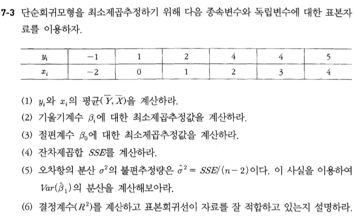
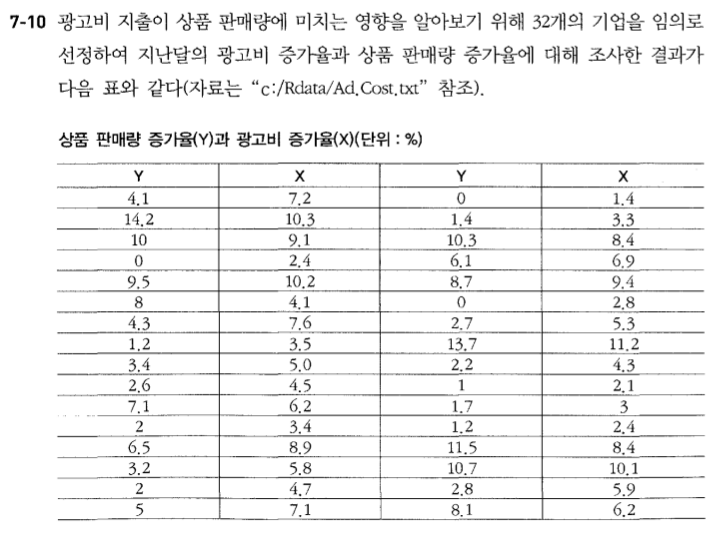
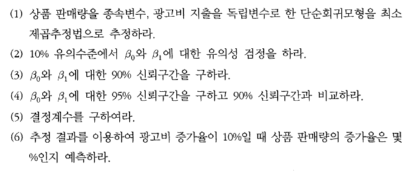
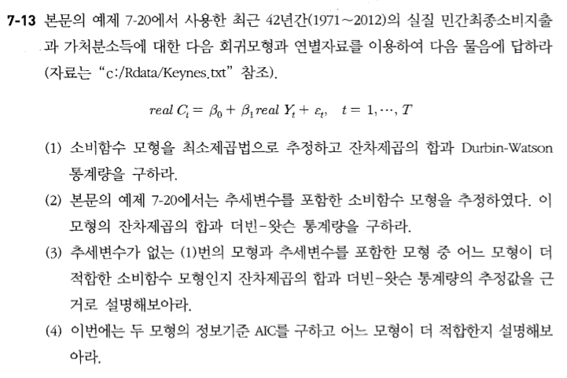
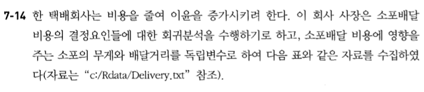

제 7장 회귀분석 연습문제
========================================================

# 7-3


## (1)

```{r}
1+3

```

## (2)

```{r}

```

## (3)

```{r}

```

## (4)

```{r}

```

## (5)

```{r}

```

## (6)

```{r}

```

---------------------------------


# 7-10



## (1)

```{r}

```

## (2)

```{r}

```

## (3)

```{r}

```

## (4)

```{r}

```

## (5)

```{r}

```

## (6)

```{r}

```

---------------------------------

# 7-13


## (1)

```{r}

```

## (2)

```{r}

```

## (3)

```{r}

```

## (4)

```{r}

```


---------------------------------

# 7-14



## (1)

```{r}

```

## (2)

```{r}

```

## (3)

```{r}

```

## (4)

```{r}

```

## (5)

```{r}

```

