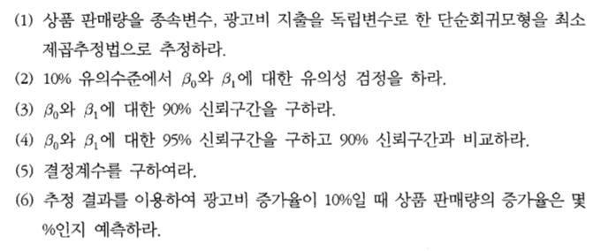

# Untitled


제 7장 회귀분석 연습문제
========================================================

# 7-3


## (1)


```r
1+3
```

```
## [1] 4
```

## (2)


## (3)


## (4)


## (5)


## (6)


---------------------------------


# 7-10



## (1)


## (2)


## (3)


## (4)


## (5)


## (6)


---------------------------------

# 7-13


## (1)


## (2)


## (3)


## (4)


---------------------------------

# 7-14


## (1)


## (2)


## (3)


## (4)


## (5)


