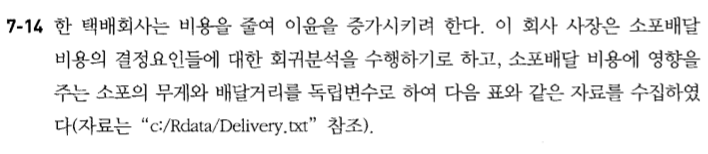

# Untitled


제 7장 회귀분석 연습문제
========================================================

# 7-3


## (1)


```r
y<-c(-1,1,2,4,4,5)
x<-c(-2,0,1,2,3,4)
mean(y)
```

```
## [1] 2.5
```

```r
mean(x)
```

```
## [1] 1.333333
```

```r
#Ybar=2.5
#xbar=1.33
```

## (2)


```r
summary(lm(y~x))
```

```
## 
## Call:
## lm(formula = y ~ x)
## 
## Residuals:
##        1        2        3        4        5        6 
## -0.07143 -0.12857 -0.15714  0.81429 -0.21429 -0.24286 
## 
## Coefficients:
##             Estimate Std. Error t value Pr(>|t|)    
## (Intercept)   1.1286     0.2223   5.076 0.007102 ** 
## x             1.0286     0.0934  11.012 0.000387 ***
## ---
## Signif. codes:  0 '***' 0.001 '**' 0.01 '*' 0.05 '.' 0.1 ' ' 1
## 
## Residual standard error: 0.4512 on 4 degrees of freedom
## Multiple R-squared:  0.9681,	Adjusted R-squared:  0.9601 
## F-statistic: 121.3 on 1 and 4 DF,  p-value: 0.0003865
```

```r
#기울기 추정량 = 1.10286
```

## (3)


```r
#절편 추정량 =1.1286
```

## (4)


```r
anova(lm(y~x))
```

```
## Analysis of Variance Table
## 
## Response: y
##           Df  Sum Sq Mean Sq F value    Pr(>F)    
## x          1 24.6857 24.6857  121.26 0.0003865 ***
## Residuals  4  0.8143  0.2036                      
## ---
## Signif. codes:  0 '***' 0.001 '**' 0.01 '*' 0.05 '.' 0.1 ' ' 1
```

```r
#잔차제곱합 SSE=0.8143
```

## (5)


## (6)


---------------------------------


# 7-10


## (1)
 1.독립변수x는 비확률적  
 2.오차항의 평균은 0  
 3.오차항은 등분산  
 4.오차항은서로독립  
 5.다공선성 발생하지 않아야한다  
 6.오차항은 정규분포를 따른다.  


## (2)


## (3)


## (4)


## (5)


## (6)


---------------------------------

# 7-13


## (1)


## (2)


## (3)


## (4)


---------------------------------

# 7-14



## (1)


## (2)


## (3)


## (4)


## (5)


